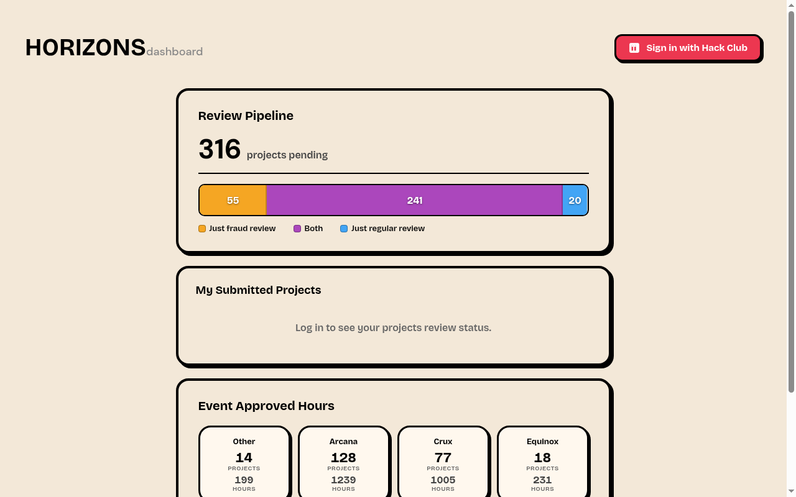

# Horizons Dashboard

A Rust web dashboard for reviewing Hack Club Horizons submissions. Built with Axum, it shows pipeline statistics, per-user projects across all review stages, and event-level approved hours.



## Features

- **Pipeline overview** -- pending review counts for fraud and normal review, displayed as a stacked bar chart
- **Your projects** -- gathers all of a user's projects from the review queue, past reviews, and fraud-rejected submissions into one sorted list, deduplicated by project so each appears once at its latest status
- **Reviewer feedback & timeline** -- shows the latest reviewer feedback per project plus an expandable history of every submission, review, and resubmission
- **Event breakdown** -- shows approved projects and total approved hours grouped by event (Nexus, Arcana, Europa, etc.)
- **Hack Club Auth (HCA) login** -- OIDC-based login with PKCE, server-side nonce validation, and no persistent secrets beyond env vars
- **Rate limiting** -- 10 requests per minute per IP on auth endpoints

## Prerequisites

- Rust (2024 edition)
- A Horizons reviewer account with Slack ID linked
- A Hack Club Auth (HCA) OAuth application with `openid slack_id` scope

## Environment Variables

| Variable | Description |
|---|---|
| `HCA_CLIENT_ID` | OAuth client ID from your HCA application |
| `HCA_CLIENT_SECRET` | OAuth client secret |
| `HCA_REDIRECT_URI` | Must match the redirect URI registered in your HCA app (e.g. `http://localhost:3001/api/auth/callback`) |
| `HORIZONS_SESSION_ID` | Horizons API session cookie value -- paste the full `connect.sid` cookie from your browser after logging into the Horizons review dashboard |
| `PORT` | Server port (default: 3001) |
| `DEV` | Set to `1`/`true` to enable the dev user-override box (top right) for previewing any user's projects by Slack ID, with no login required. Leave unset in production. |
| `ADMIN_USERS` | Comma-separated Slack IDs (e.g. `U0123,U0344`) allowed to use the user-override box while logged in — works in production. |

## Running

```sh
export HCA_CLIENT_ID=...
export HCA_CLIENT_SECRET=...
export HCA_REDIRECT_URI=...
export HORIZONS_SESSION_ID=...

cargo run
```

Then open `http://localhost:3001`.

## Deployment

The app is a single Axum binary. Deploy it behind a reverse proxy (Caddy, nginx) if you want HTTPS. The `SameSite=Lax` cookie works over HTTP for local dev -- add `Secure` to the cookie header in `src/main.rs` if deploying behind HTTPS.

Make sure the `HCA_REDIRECT_URI` points to the public URL of your deployed instance.
